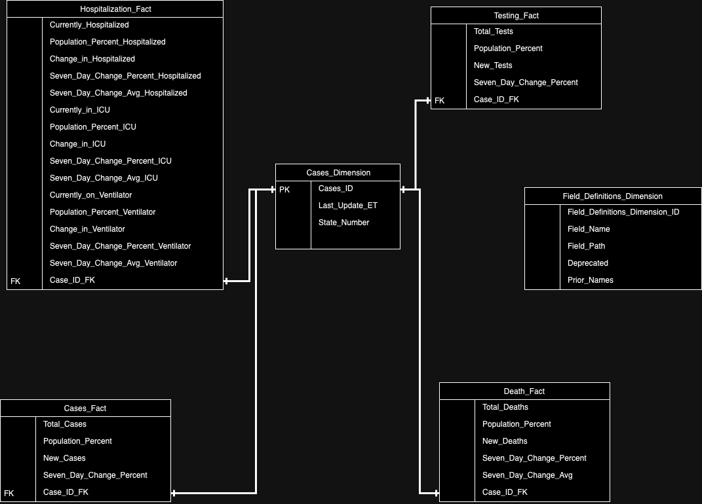

## DataOps Engineer Challenge

<!-- Improved compatibility of back to top link: See: https://github.com/othneildrew/Best-README-Template/pull/73 -->
<a name="readme-top"></a>
<!--

[![LinkedIn][linkedin-shield]][linkedin-url]

<!-- TABLE OF CONTENTS -->
<details>
  <summary>Table of Contents</summary>
  <ol>
    <li>
      <a href="#about-the-project">About The Project</a>
      <ul>
        <li><a href="#built-with">Built With</a></li>
      </ul>
    </li>
    <li>
      <a href="#getting-started">Getting Started</a>
      <ul>
        <li><a href="#prerequisites">Prerequisites</a></li>
        <li><a href="#installation">Installation</a></li>
        <li><a href="#usage">Usage</a></li>
	<li><a href="#todo">Todo</a></li>
	<li><a href="#consideration-to-put-into-production">Production consideration</a></li>      
      </ul>
    </li>
  </ol>
</details>

<!-- ABOUT THE PROJECT -->
## About The Project

The project ingests daily COVID-19-related data made available by the API described [here](https://covidtracking.com/data/api/version-2).

The projects perform extraction, transformation and loading processes on the data returned from the API. The data is returned as a JSON object and 

<p align="right">(<a href="#readme-top">back to top</a>)</p>

### Built With

* [![Python][python]][python-url]

<p align="right">(<a href="#readme-top">back to top</a>)</p>
<!-- GETTING STARTED -->

## Getting Started

Certain assumptions are made with the deployment of the projects, such as experience with git and Unix commands and having git and docker installed.

The ERD of the database is shown below:


The database has been modelled according to the Star schema to represent the data and make the database optimal for querying.

### Prerequisites

* git
* docker

### Installation

Steps to install and run the program

1. Clone the repo
   ```sh
   git clone https://github.com/Marthinusba/reach_challenge.git
   ```
2. Change directory to reach-challenge
   ```sh
   cd reach-challenge
   ```
3. Run docker compose command
   ```sh
   docker-compose up --build
   ```

<p align="right">(<a href="#readme-top">back to top</a>)</p>

<!-- USAGE EXAMPLES -->
## Usage

The current date is set as  ```current_date = '2021-01-01'```  in the ```main.py``` script to load example data. However, it should be changed to ```current_date = datetime.now().date()``` for daily updates.

1. To access the Postgres database in docker to perform analysis.
    ```sh
    docker exec -it docker_postgresql bash
    ```
2. And to access the database:
    ```sh
    psql -h docker_postgresql -d postgres_db -U postgres_user
    ```
3. The password required is ```postgres_password```

4. Example to query all the tables
    ```sql
    select * from Cases_Dimension
    join Cases_Fact on Cases_Dimension.cases_id = Cases_Fact.cases_id
    join Testing_Fact on Cases_Dimension.cases_id = Testing_Fact.cases_id
    join Hospitalization_Fact on Cases_Dimension.cases_id = Hospitalization_Fact.cases_id
    join Death_Fact on Cases_Dimension.cases_id = Death_Fact.cases_id
    ;
    ```

<p align="right">(<a href="#readme-top">back to top</a>)</p>

## TODO

* Include unit and integration testing
* Ingest metadata, specifically the schema changes, to record any name changes to alert on breaking changes.
* Setup a cron job to run the python program daily
* Create documentation with pydoc

## Consideration to put into Production

* Create a CI/CD pipeline to deploy the project to AWS ECS with an additional cron/orchestration tool to run the program on a daily basis. Unit and integration testing is performed during the CI/DC pipeline deployment. For the production version, logging should be introduced, better error handeling and alerting. Additionally, the secrets required should not be exposed and handled by the secrets manager.  

<p align="right">(<a href="#readme-top">back to top</a>)</p>


<!-- MARKDOWN LINKS & IMAGES -->
<!-- https://www.markdownguide.org/basic-syntax/#reference-style-links -->

[linkedin-shield]: https://img.shields.io/badge/-LinkedIn-black.svg?style=for-the-badge&logo=linkedin&colorB=555
[linkedin-url]: https://www.linkedin.com/in/marthinusbasson/

[python]: https://img.shields.io/badge/python-000000?style=for-the-badge&logo=nextdotjs&logoColor=white
[python-url]: https://python.org/
